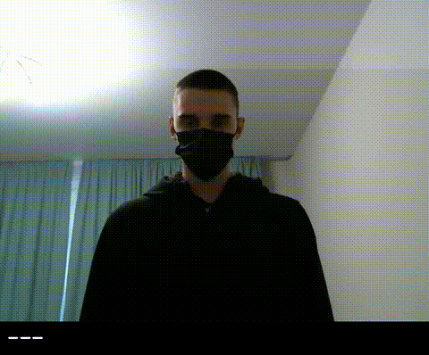

# Slovo - Russian Sign Language Dataset

We introduce a large-scale video dataset **Slovo** for Russian Sign Language task. Slovo dataset size is about **16 GB**, and it contains **20400** RGB videos for **1000** sign language gestures from 194 singers. Each class has 20 samples. The dataset is divided into training set and test set by subject `user_id`. The training set includes 15300 videos, and the test set includes 5100 videos. The total video recording time is ~9.2 hours. About 35% of the videos are recorded in HD format, and 65% of the videos are in FullHD resolution. The average video length with gesture is 50 frames.

For more information see our paper - [arXiv]().

## Downloads
### [Download Link](https://n-ws-620xz-pd11.s3pd11.sbercloud.ru/b-ws-620xz-pd11-jux/slovo/slovo.zip)

Also, you can download it from [Kaggle](https://www.kaggle.com/datasets/kapitanov/slovo).

Annotation file is easy to use and contains some useful columns, see `annotations.csv` file:

|    | attachment_id | user_id | width | height | length |  text  | train   | begin | end |
|---:|:--------------|:--------|------:|-------:|-------:|-------:|:--------|:------|:----|
|  0 | de81cc1c-...  | 1b...   |  1440 |   1920 |     14 | привет | True    | 30    | 45  |
|  1 | 3c0cec5a-...  | 64...   |  1440 |   1920 |     32 |   утро | False   | 43    | 66  |
|  2 | d17ca986-...  | cf...   |  1920 |   1080 |     44 |  улица | False   | 12    | 31  |

where:
- `attachment_id` - video file name
- `user_id` - unique anonymized user ID
- `width` - video width
- `height` - video height
- `length` - video length
- `text` - gesture class in Russian Langauge
- `train` - train or test boolean flag
- `begin` - start of the gesture (for original dataset)
- `end` - end of the gesture (for original dataset)

For convenience, we have also prepared a compressed version of the dataset, in which all videos are processed by the minimum side `min_side = 360`. Download link - **[slovo360p](https://n-ws-620xz-pd11.s3pd11.sbercloud.ru/b-ws-620xz-pd11-jux/slovo/slovo360.zip)**.

## Models
We provide some pre-trained models as the baseline for russian sign language recognition.

| Model Name                                 | Parameters (M) | Metric    |
|--------------------------------------------|----------------|-----------|
| [model](link)                              | X              |  X        |

## Demo
```console
python demo.py -p <PATH_TO_CONFIG>
```



## Authors and Credits
- [Kapitanov Alexander](https://www.linkedin.com/in/hukenovs)
- [Kvanchiani Karina](https://www.linkedin.com/in/kvanchiani)
- [Nagaev Alexander](https://www.linkedin.com/in/nagadit/)
- [Petrova Elizaveta](https://www.linkedin.com/in/elizaveta-petrova-248135263/)

## Citation
You can cite the paper using the following BibTeX entry:

    @article{Slovo,
        title={Slovo - Russian Sign Language Dataset and Models},
        author={Kapitanov, Alexander and Kvanchiani, Karina and Nagaev, Alexander and Petrova, Elizaveta},
        journal={arXiv preprint <link>},
        year={2023}
    }

## Links
- [arXiv]()
- [Kaggle](https://www.kaggle.com/datasets/kapitanov/slovo)
- [Habr]()
- [Medium]()
- [Gitlab](https://gitlab.aicloud.sbercloud.ru/rndcv/slovo)
- [Paperswithcode]()

## License
<a rel="license" href="http://creativecommons.org/licenses/by-sa/4.0/"></a><br />This work is licensed under a variant of <a rel="license" href="http://creativecommons.org/licenses/by-sa/4.0/">Creative Commons Attribution-ShareAlike 4.0 International License</a>.

Please see the specific [license](https://github.com/hukenovs/slovo/blob/master/license/en_us.pdf).
